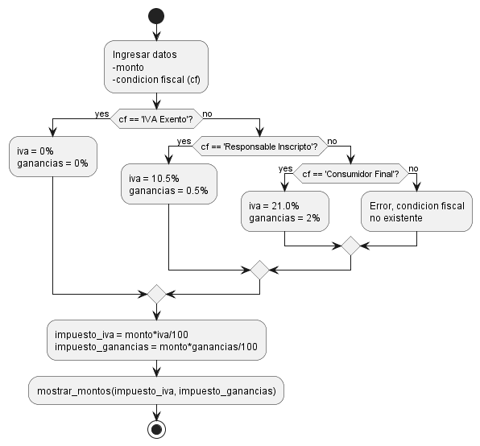

# Proyecto: Calculadora Impositiva

## Objetivo 
- El objetivo de este módulo de software es asistir a un usuario vendedor con los impuestos aplicables a cada una de sus transacciones.

## Alcance
- Incorpora impuestos nacionales (__IVA__, Ganancias *de ahora en más __IIGG__*), y provinciales (Ingresos Brutos, *de ahora en más __IIBB__*) 

## Diseño y Arquitectura

### Reglas de negocio

#### Impuestos nacionales
- Los impuestos nacionales se aplican en base a la condición fiscal (*__CF__*) ingresada por pantalla. Pueden tomar tres valores:
1. IVA Exento: para usuarios excluídos de impuestos nacionales, por ejemplo entes estatales o empresas del estado.
2. Responsable Inscripto: Para personas inscriptas en el régimen IVA, por ejemplo, monotributistas.
3. Consumidor Final: Para personas que no están inscriptas en IVA, por ejemplo, vendedores casuales.

- Diagrama de Actividad:

Codigo PUML
<iframe src="./diagramas/impuestos-nacionales.puml"></iframe>