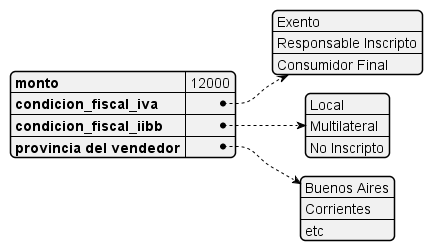

# Proyecto: Calculadora Impositiva

## Objetivo 
- El objetivo de este módulo de software es asistir a un usuario vendedor con los impuestos aplicables a cada una de sus transacciones.

## Alcance
- Incorpora impuestos nacionales (__IVA__, Ganancias *de ahora en más __IIGG__*), y provinciales (Ingresos Brutos, *de ahora en más __IIBB__*) 
- La exactitud contable no está asegurada. Es posible que una o más reglas de negocio de la calculadora estén sujetas a cambios, en su configuración actual o futura.

## Diseño y Arquitectura

### Casos de uso

- Especificación

### Contrato

#### Entrada
- El usuario ingresará los siguientes datos de entrada:

#### Salida

- El usuario visualizará los siguientes datos en la pantalla:

### Reglas de negocio

#### Impuestos nacionales
- Los impuestos nacionales se aplican en base a la condición fiscal (*__CF__*) ingresada por pantalla. Pueden tomar tres valores:
1. IVA Exento: para usuarios excluídos de impuestos nacionales, por ejemplo entes estatales o empresas del estado.
2. Responsable Inscripto: Para personas inscriptas en el régimen IVA, por ejemplo, monotributistas.
3. Consumidor Final: Para personas que no están inscriptas en IVA, por ejemplo, vendedores casuales.

- Diagrama de Actividad:

#### Impuestos provinciales
- Los impuestos provinciales se aplican en base al régimen IIBB (*__reg__*) ingresado por pantalla. Pueden tomar tres valores:
1. No Inscripto: El usuario no está inscripto en ningún régimen. Aplica la alícuota más alta.
2. Local: El usuario está inscripto sólo en su provincia, aplica una alícuota intermedia.
3. Multilateral: El usuario está inscripto en varias provincias,
aplica la alícuota de menor magnitud.

- Diagrama de Actividad:

- Las alicuotas de cada provincia se extraen de la matriz de jurisdicciones
- Cada fila de la matriz representa una provincia, notada por ID de jurisdicción.
- Cada columna de la matriz, representa un régimen

